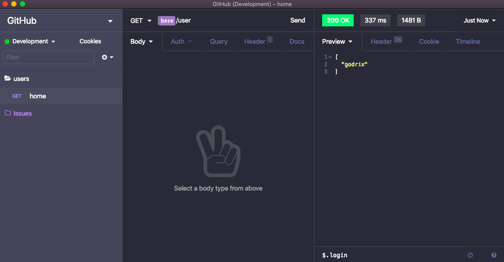

# 🧛 Insomnia Plugin Dracula Soft Theme

  
  

### 🚀 Installation

- Access the Application / Preferences menu and then select the Plugins tab, enter the plugin name `insomnia-plugin-dracula-soft-theme` and click Install Plugin.

- After installing the plugin click on enable

### 🤝 Contributing

Contributions, issues and feature requests are welcome! Feel free to check [issues page](https://github.com/godrix/insomnia-plugin-dracula-soft-theme/issues).
- Make a fork;
- Create a branck with your feature: `git checkout -b awesome-feature`;
- Commit changes: `git commit -m 'feat: My awesome feature'`;
- Make a push to your branch: `git push origin awesome-feature`.

After merging your receipt request to done, you can delete a branch from yours.

### Show your support

Give a ⭐️ if this project helped you!

### :memo: License

This project is under the MIT license. See the [LICENSE](LICENSE.md) for details.

---

Made with ♥ by Godrix :wave: [Get in touch!](https://www.linkedin.com/in/carlosgodri/)